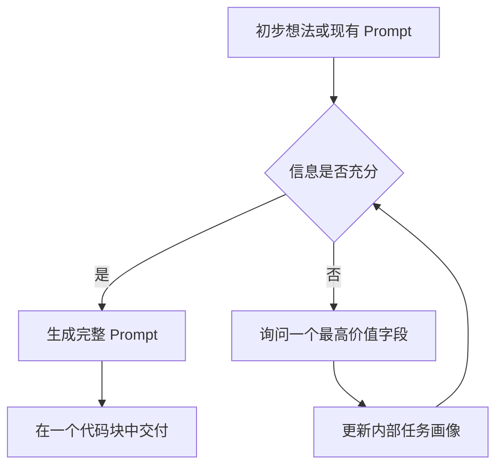
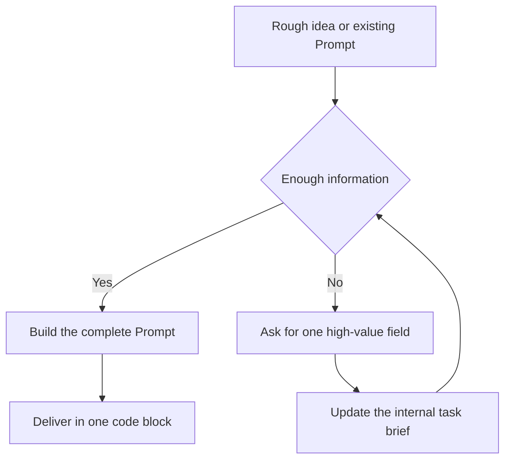

# Amazzzing-prompts

> 通过自适应多轮对话，把一句模糊想法整理成一份真正可用的 Prompt。
>
> Turn a rough idea into a complete, usable Prompt through adaptive conversation.

[中文](#中文) | [English](#english)

## 中文

### 简介

`Amazzzing-prompts` 是一个面向 ChatGPT 和 Codex 的通用 Prompt 构建 Skill。

你只需要说出最初的想法，或者提供一份需要优化的 Prompt。它会动态判断任务类型，识别当前最重要的信息缺口，通过有限的多轮对话补齐关键条件，最终交付一份可以直接复制使用的完整 Prompt。

Skill 运行于 ChatGPT 或 Codex，生成的 Prompt 可以用于 ChatGPT、Codex、Claude、Gemini、DeepSeek 等通用 AI。

### 为什么需要它

很多 Prompt 生成方式会遇到三个问题：

1. 用户信息还不充分，AI 已经开始生成，结果看起来完整，实际无法解决问题。
2. AI 一次提出大量问题，用户需要填写一份冗长的问卷。
3. 固定模板很难适配研究、写作、编程、图片生成、商业分析等不同任务。

`Amazzzing-prompts` 采用自适应澄清机制。每一轮只寻找一个最影响结果的信息字段，信息足够后立即停止追问。

### 核心特性

- **完全通用**：不预设任务类型，也不绑定具体 AI 平台。
- **自适应追问**：根据上下文判断下一项最值得确认的信息。
- **每轮一个字段**：一次只请求一个可以直接回答的信息点，避免问卷式对话。
- **最多七轮**：前六轮可以澄清，第七轮必须交付最终 Prompt。
- **允许提前完成**：信息充分、继续提问价值不高，或用户要求直接生成时，立即输出。
- **支持优化现有 Prompt**：保留原有意图和有效信息，修复歧义、遗漏、冲突与冗余。
- **合理处理缺失信息**：低风险内容由上下文推断，无法确认的部分采用保守假设。
- **干净交付**：最终只输出一份完整 Prompt，并放在一个 Markdown 代码块中。

### 工作方式



Skill 会在内部关注目标、场景、必要输入、受众、输出形式、约束、质量标准和不确定性处理。它不会机械地逐项询问，只会选择当前最有价值的问题。

### 安装

#### Codex 用户级安装

Codex 会扫描 `$HOME/.agents/skills` 中的个人 Skill。执行：

```bash
mkdir -p "$HOME/.agents/skills"
git clone https://github.com/terrysnake/amazzzing-prompts.git \
  "$HOME/.agents/skills/amazzzing-prompts"
```

安装后，Codex 通常会自动发现 Skill。如果暂未出现，请重新打开 Codex。

#### Codex 仓库级安装

如果只希望在当前代码仓库中使用：

```bash
mkdir -p .agents/skills
git clone https://github.com/terrysnake/amazzzing-prompts.git \
  .agents/skills/amazzzing-prompts
```

将 `.agents/skills/amazzzing-prompts` 提交到你的仓库后，团队成员可以共享同一套 Prompt 构建流程。

#### ChatGPT

在支持自定义 Skills 的 ChatGPT 环境中，打开 **Skills**，根据界面提供的创建或导入方式添加本项目，并使用仓库中的 `SKILL.md`。

不同账号和工作区的 Skills 功能可能存在差异。需要在团队或更大范围内分发时，可以依据 OpenAI 的官方指南将 Skill 打包为 Plugin：

- [Build skills](https://learn.chatgpt.com/docs/build-skills)
- [Skills & Plugins](https://learn.chatgpt.com/docs/skills-and-plugins)

### 使用方法

在 Codex 中输入 `$` 选择 Skill，或直接调用：

```text
$amazzzing-prompts 我想做一份面向集团领导的海外智算中心项目汇报。
```

在支持 Skill 选择的 ChatGPT 环境中，可以从编辑器选择 `Amazzzing-prompts`，或使用 `@` 提及：

```text
@amazzzing-prompts 我要调研这家公司：https://www.ge.com/
```

也可以直接描述任务。当请求与 Skill 的用途高度匹配时，ChatGPT 或 Codex 可以自动启用它。

### 使用示例

#### 从一句模糊想法开始

```text
用户：
$amazzzing-prompts 我想研究一家公司的真实实力。

Amazzzing-prompts：
你想研究哪家公司？请提供公司名称。

用户：
英伟达。

Amazzzing-prompts：
这份调研主要用于个人了解、投资判断，还是商业合作决策？
```

信息充分后，Skill 会生成一份包含调研目标、证据要求、分析框架、输出格式和质量标准的完整 Prompt。

#### 优化已有 Prompt

```text
$amazzzing-prompts 优化下面的 Prompt：
帮我分析一下这家公司。
```

Skill 会保留“分析公司”这一目标，继续确认真正影响结果的信息，例如公司身份、分析用途和调研深度，然后生成可执行的版本。

#### 直接生成

```text
$amazzzing-prompts 帮我写一个 Prompt，用来把会议录音整理成纪要。
其余细节你决定，直接生成。
```

当用户明确要求直接生成时，Skill 会停止追问，采用合理默认值完成 Prompt。

### 适用场景

- 深度研究与公司调研
- 商业分析与方案设计
- 报告、演讲、公文和内容写作
- 编程、调试和代码审查
- 图片、视频和多模态生成
- 数据分析与结构化输出
- 智能体任务设计
- 对已有 Prompt 进行重写和增强

### 设计原则

1. **问题价值优先**：只询问会明显改变结果的问题。
2. **降低交互负担**：每轮只处理一个信息字段。
3. **有限澄清**：复杂任务最多用七轮完成，简单任务尽早交付。
4. **任务驱动结构**：根据需求选择 Prompt 组成部分，避免套用固定模板。
5. **模型无关**：最终 Prompt 不依赖某个平台的专有能力。
6. **可直接使用**：交付内容完整、内部一致、便于复制。

#### 局限性

- Skill 可以改善需求澄清和 Prompt 结构，无法保证目标 AI 生成的事实一定正确。
- 医疗、法律、金融和安全等高风险任务仍需专业人员审核。
- 如果任务依赖未提供的文件、实时数据或外部工具，最终 Prompt 会说明所需输入和验证方式。
- 不同模型对同一 Skill 的执行可能存在少量差异。

### 项目结构

```text
amazzzing-prompts/
├── SKILL.md
├── agents/
│   └── openai.yaml
├── README.md
└── LICENSE
```

- `SKILL.md`：核心工作流和行为规则。
- `agents/openai.yaml`：Skill 的界面名称、简介和默认调用示例。
- `README.md`：项目介绍、安装方法和使用文档。
- `LICENSE`：MIT 开源许可证。

### 贡献

欢迎提交 Issue 和 Pull Request。以下反馈尤其有价值：

- 一轮中索取了多个信息字段
- 问题与最终结果关系不大
- 已经明确的信息被重复询问
- 用户要求直接生成后仍继续追问
- 第七轮仍未交付最终 Prompt
- 优化时丢失了原 Prompt 的有效要求
- 某类任务长期生成效果不稳定

提交行为问题时，建议附上：

1. 最初的用户请求
2. 实际对话过程
3. 你期望的行为
4. 使用的 ChatGPT 或 Codex 环境

### License

本项目使用 [MIT License](LICENSE)。

## English

### Introduction

`Amazzzing-prompts` is a general-purpose Prompt-building Skill for ChatGPT and Codex.

Start with a rough idea or an existing Prompt. The Skill dynamically identifies the task, finds the most important missing information, asks focused questions within a limited conversation, and delivers one complete Prompt that is ready to copy and use.

The Skill runs in ChatGPT or Codex. The Prompts it creates can be used with general-purpose AI systems such as ChatGPT, Codex, Claude, Gemini, and DeepSeek.

### Why It Exists

Many Prompt generators have three recurring problems:

1. They generate too early, before the user has supplied enough information.
2. They ask a long list of questions at once and turn the conversation into a form.
3. They rely on fixed templates that do not adapt well to research, writing, coding, image generation, or business analysis.

`Amazzzing-prompts` uses adaptive clarification. Each round focuses on the single information field most likely to improve the final result, and the conversation stops as soon as enough information is available.

### Key Features

- **General purpose**: No predefined task category and no dependency on a specific AI platform.
- **Adaptive clarification**: Selects the next question from the current context.
- **One field per round**: Requests one directly answerable information field at a time.
- **Seven-response ceiling**: The first six responses may clarify; the seventh must deliver.
- **Early completion**: Generates immediately when the information is sufficient or the user asks to proceed.
- **Existing Prompt optimization**: Preserves valid intent and information while fixing ambiguity, omissions, conflicts, and redundancy.
- **Reasonable assumptions**: Infers low-risk details and handles uncertainty conservatively.
- **Clean delivery**: Returns exactly one complete Prompt inside one Markdown code block.

### How It Works



Internally, the Skill considers the desired result, scenario, required inputs, audience, output form, constraints, quality criteria, and uncertainty handling. It does not expose those dimensions as a fixed questionnaire.

### Installation

#### User-level installation for Codex

Codex scans `$HOME/.agents/skills` for personal Skills:

```bash
mkdir -p "$HOME/.agents/skills"
git clone https://github.com/terrysnake/amazzzing-prompts.git \
  "$HOME/.agents/skills/amazzzing-prompts"
```

Codex normally detects the Skill automatically. If it does not appear, reopen Codex.

#### Repository-level installation for Codex

To use the Skill only within the current repository:

```bash
mkdir -p .agents/skills
git clone https://github.com/terrysnake/amazzzing-prompts.git \
  .agents/skills/amazzzing-prompts
```

Commit `.agents/skills/amazzzing-prompts` to your repository when you want the whole team to share the same Prompt-building workflow.

#### ChatGPT

In a ChatGPT environment that supports custom Skills, open **Skills** and use the available create or import flow with this repository's `SKILL.md`.

Skills availability can vary by account and workspace. For broader team distribution, package the Skill as a Plugin by following OpenAI's official guidance:

- [Build skills](https://learn.chatgpt.com/docs/build-skills)
- [Skills & Plugins](https://learn.chatgpt.com/docs/skills-and-plugins)

### Usage

In Codex, type `$` to choose a Skill or invoke it directly:

```text
$amazzzing-prompts I need an executive presentation for an overseas AI data center project.
```

In a ChatGPT environment with Skill selection, choose `Amazzzing-prompts` from the composer or mention it with `@`:

```text
@amazzzing-prompts I want to research this company: https://www.ge.com/
```

You can also describe the task directly. ChatGPT or Codex may activate the Skill automatically when the request closely matches its description.

### Examples

#### Start with a rough idea

```text
User:
$amazzzing-prompts I want to understand the real strength of a company.

Amazzzing-prompts:
Which company do you want to research? Please provide its name.

User:
NVIDIA.

Amazzzing-prompts:
Will this research be used for general understanding, investment analysis, or a business partnership decision?
```

Once enough information is available, the Skill creates a complete Prompt with a research objective, evidence rules, analytical framework, output format, and quality criteria.

#### Improve an existing Prompt

```text
$amazzzing-prompts Improve this Prompt:
Analyze this company for me.
```

The Skill preserves the company-analysis goal, asks only for information that materially affects the result, and produces an executable version.

#### Generate immediately

```text
$amazzzing-prompts Create a Prompt that turns a meeting recording into meeting minutes.
Choose the remaining details and generate it now.
```

When the user explicitly requests immediate generation, the Skill stops clarifying and completes the Prompt with reasonable defaults.

### Use Cases

- Deep research and company analysis
- Business analysis and solution design
- Reports, speeches, formal documents, and content writing
- Programming, debugging, and code review
- Image, video, and multimodal generation
- Data analysis and structured outputs
- Agent task design
- Rewriting and strengthening existing Prompts

### Design Principles

1. **Question value first**: Ask only when the answer can materially change the result.
2. **Low interaction cost**: Request one information field per round.
3. **Bounded clarification**: Finish within seven responses and complete simple tasks earlier.
4. **Task-driven structure**: Select Prompt components from the task instead of applying a fixed template.
5. **Model agnostic**: Avoid proprietary features in the generated Prompt.
6. **Ready to use**: Deliver a complete, internally consistent, copyable Prompt.

#### Limitations

- The Skill improves requirement clarification and Prompt structure, but it cannot guarantee that the target AI will produce factually correct results.
- Medical, legal, financial, security, and other high-risk tasks still require expert review.
- Tasks that depend on missing files, live data, or external tools still require those inputs or a verification method.
- Different models may follow the same Skill with small behavioral variations.

### Project Structure

```text
amazzzing-prompts/
├── SKILL.md
├── agents/
│   └── openai.yaml
├── README.md
└── LICENSE
```

- `SKILL.md`: Core workflow and behavioral rules.
- `agents/openai.yaml`: Display metadata and the default invocation example.
- `README.md`: Project overview, installation, and usage documentation.
- `LICENSE`: MIT open-source license.

### Contributing

Issues and pull requests are welcome. The following reports are especially useful:

- A response requests multiple information fields
- A question has little impact on the final result
- The Skill repeats information the user already supplied
- Clarification continues after the user requests immediate generation
- The seventh response does not deliver the final Prompt
- Existing Prompt requirements are lost during optimization
- A specific task category produces inconsistent results

For behavioral issues, please include:

1. The initial user request
2. The actual conversation
3. The behavior you expected
4. The ChatGPT or Codex environment you used

### License

This project is licensed under the [MIT License](LICENSE).
